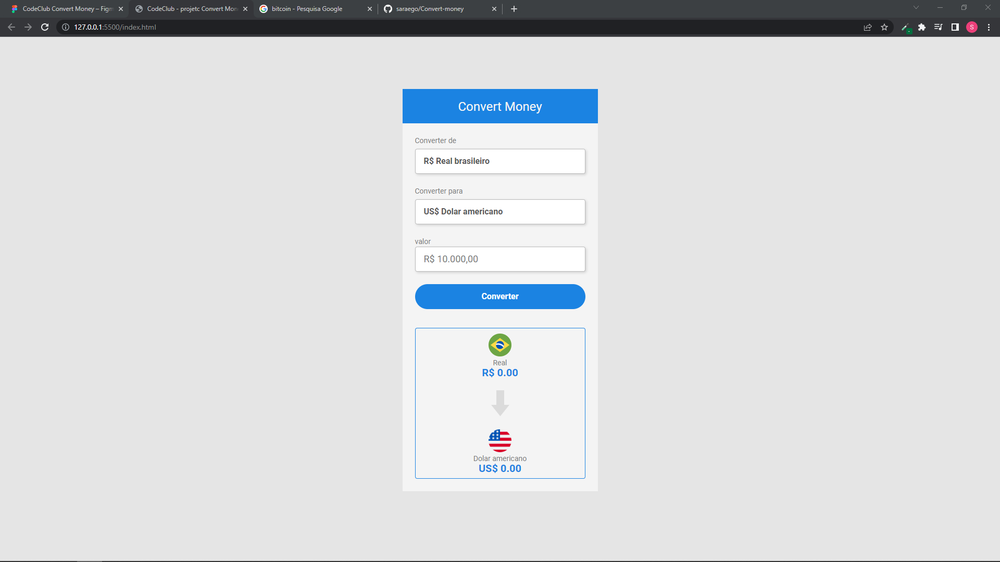

# estudosjs-partWeb
Estudos

# Criançao de minPage basico para praticar html css e JavaScript

> Concluido estudo com html css e js.

Criando um converso de moedas com objetvo de praticar:

- [x] Criação do HTML
- [x] Criação do CSS
- [x] JavaScript
